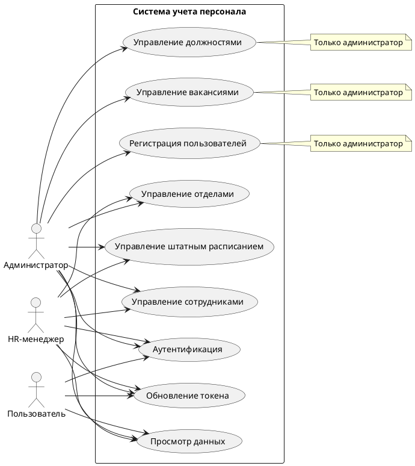
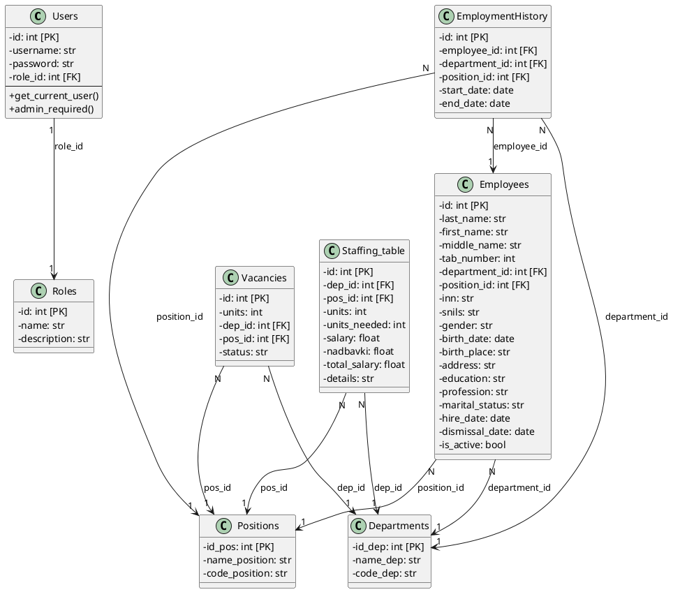
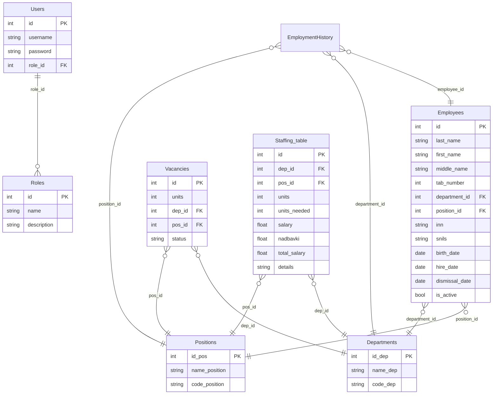
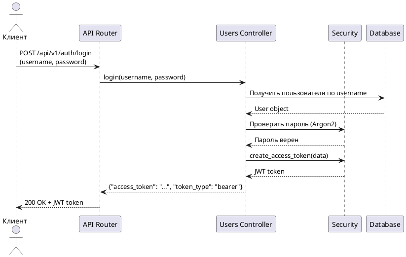
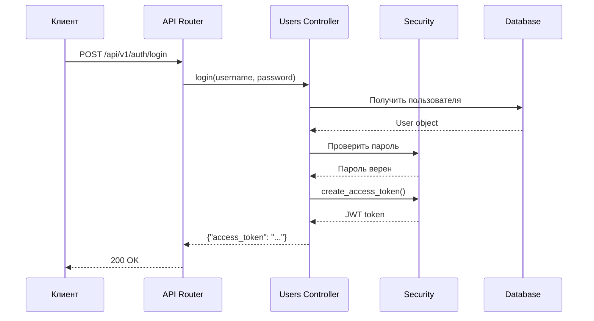
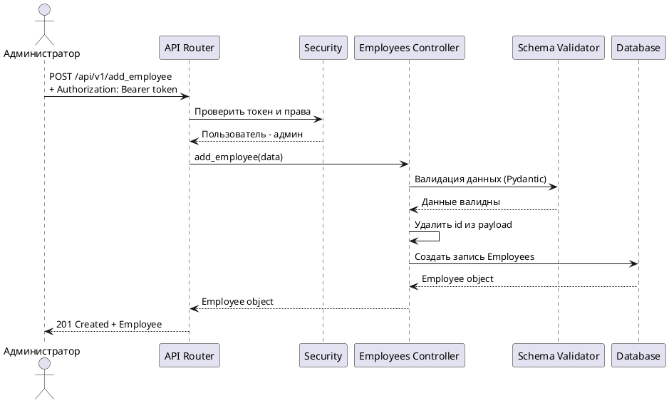
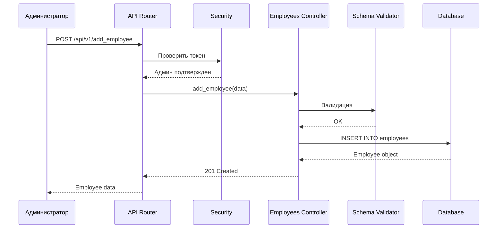
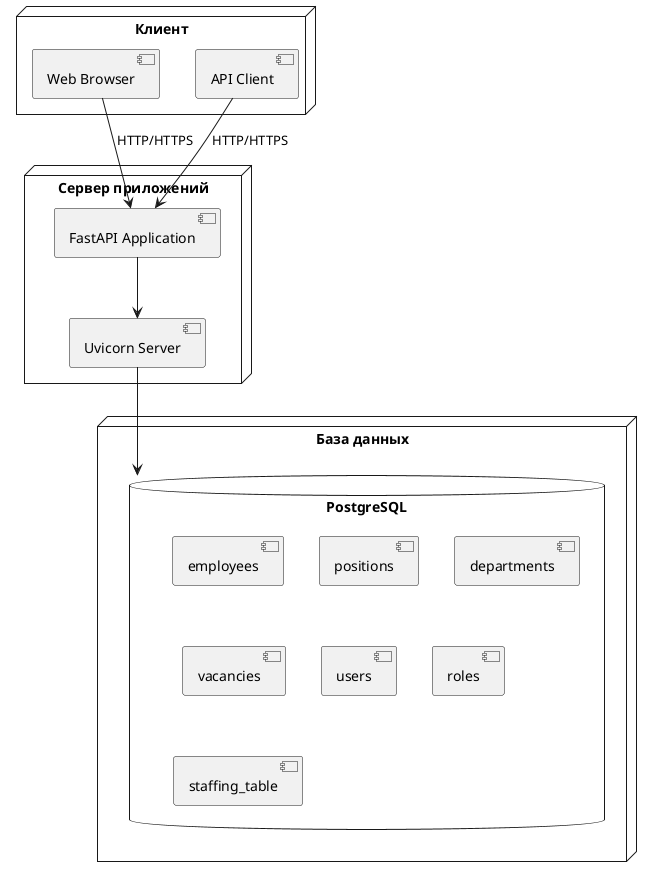
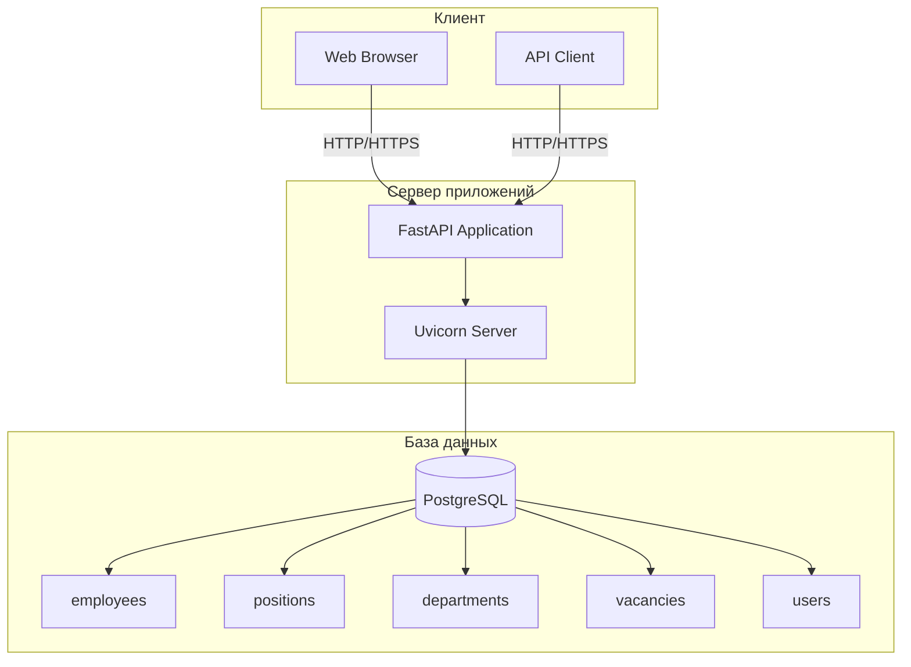

# ПОЯСНИТЕЛЬНАЯ ЗАПИСКА

## REST API для учета персонала, вакансий и штатного расписания

---

**Автор:** Перетолчин Е.А  
**Организация:** Pencil Corporation  
**Версия:** 1.0.0  
**Дата:** 2025

---

## 1. ВВЕДЕНИЕ

В современном мире эффективное управление персоналом является критически важным аспектом для успешного функционирования любой организации. Автоматизация процессов учета сотрудников, управления вакансиями и штатным расписанием позволяет существенно повысить эффективность работы HR-отдела и обеспечить прозрачность кадровых процессов.

Данный проект представляет собой RESTful API, разработанный на основе современного фреймворка FastAPI, предназначенный для комплексного управления персоналом организации. API обеспечивает полный цикл работы с кадровыми данными: от регистрации сотрудников до управления вакансиями и штатным расписанием.

Проект реализует стандарты REST API, обеспечивает безопасность данных через механизмы OAuth2 и JWT, и предоставляет интуитивно понятный интерфейс для взаимодействия с системой учета персонала.

---

## 2. АНАЛИТИЧЕСКАЯ ЧАСТЬ

### 2.1. Общее описание проекта

#### Назначение сервиса

REST API для учета персонала, вакансий и штатного расписания предназначен для автоматизации процессов управления кадровыми ресурсами организации. Система обеспечивает централизованное хранение и обработку информации о сотрудниках, должностях, отделах, вакансиях и штатном расписании.

#### Ключевые сценарии использования

1. **Управление сотрудниками:**
   - Прием новых сотрудников на работу
   - Ведение личных дел сотрудников
   - Перевод сотрудников между должностями и отделами
   - Увольнение сотрудников
   - Просмотр списка активных и уволенных сотрудников
   - Фильтрация сотрудников по отделам

2. **Управление должностями:**
   - Создание и редактирование должностей
   - Просмотр списка всех должностей
   - Удаление должностей

3. **Управление вакансиями:**
   - Создание вакансий с указанием отдела и должности
   - Управление статусами вакансий (открыта/закрыта)
   - Просмотр списка вакансий

4. **Управление отделами:**
   - Просмотр списка отделов
   - Редактирование информации об отделах

5. **Штатное расписание:**
   - Просмотр штатного расписания с информацией о должностях и отделах
   - Редактирование штатного расписания
   - Автоматическое обновление количества работников (units) на основе реальных данных

6. **Аутентификация и авторизация:**
   - Регистрация пользователей (обычный пользователь, HR-менеджер, администратор)
   - Вход в систему
   - Управление правами доступа (обычный пользователь/HR-менеджер/администратор)

#### Основные функции

- **CRUD операции** для всех сущностей системы (сотрудники, должности, вакансии, отделы, штатное расписание)
- **Пагинация** для больших списков данных
- **Фильтрация** сотрудников по отделам
- **Ролевая модель доступа** (RBAC) с тремя ролями
- **JWT аутентификация** с поддержкой обновления токенов
- **Валидация данных** на уровне API
- **Обработка ошибок** с информативными сообщениями
- **Автоматическое обновление** количества единиц в штатном расписании
- **Генератор тестовых данных** для разработки и тестирования

#### Диаграмма прецедентов

**PlantUML код:**


**Mermaid код:**


```mermaid
graph TB
    Admin[Администратор]
    HR[HR-менеджер]
    User[Пользователь]
    System[Система учета персонала]
    
    UC1[Управление сотрудниками]
    UC2[Управление должностями]
    UC3[Управление вакансиями]
    UC4[Управление отделами]
    UC5[Управление штатным расписанием]
    UC6[Регистрация пользователей]
    UC7[Просмотр данных]
    UC8[Аутентификация]
    UC9[Обновление токена]
    
    Admin --> UC1
    Admin --> UC2
    Admin --> UC3
    Admin --> UC4
    Admin --> UC5
    Admin --> UC6
    Admin --> UC7
    Admin --> UC8
    Admin --> UC9
    
    HR --> UC1
    HR --> UC4
    HR --> UC5
    HR --> UC7
    HR --> UC8
    HR --> UC9
    
    User --> UC7
    User --> UC8
    User --> UC9
    
    style UC2 fill:#ffcccc
    style UC3 fill:#ffcccc
    style UC6 fill:#ffcccc
```

### 2.2. Технологический стек

#### Используемые платформы и языки программирования

- **Python 3.8+** - основной язык программирования
- **PostgreSQL** - реляционная база данных для хранения данных

#### Фреймворки и библиотеки

**Веб-фреймворк:**
- **FastAPI 0.120.4** - современный асинхронный веб-фреймворк для создания REST API
  - Автоматическая генерация документации OpenAPI/Swagger
  - Встроенная валидация данных через Pydantic
  - Высокая производительность

**ORM и работа с БД:**
- **SQLModel 0.0.27** - ORM на основе SQLAlchemy и Pydantic
  - Объединение возможностей SQLAlchemy и Pydantic
  - Автоматическая валидация данных
- **SQLAlchemy 2.0.44** - мощный ORM для работы с базами данных
- **psycopg2 2.9.11** - драйвер для подключения к PostgreSQL
- **Alembic 1.17.2** - система миграций базы данных

**Валидация и сериализация:**
- **Pydantic 2.12.3** - валидация данных и сериализация
- **pydantic_core 2.41.4** - ядро Pydantic

**Безопасность:**
- **python-jose 3.5.0** - работа с JWT токенами
- **argon2-cffi 25.1.0** - хеширование паролей (современный алгоритм Argon2)

**Дополнительные библиотеки:**
- **fastapi-pagination 0.15.0** - пагинация для FastAPI
- **python-dotenv 1.2.1** - работа с переменными окружения
- **uvicorn 0.38.0** - ASGI сервер для запуска FastAPI приложения
- **Faker 24.0.0** - генерация тестовых данных для разработки и тестирования

### 2.3. Архитектура приложения

#### Описание слоёв приложения

Проект следует многослойной архитектуре, обеспечивающей разделение ответственности и упрощающей поддержку и масштабирование приложения.

**1. Слой API (API Gateway)**
- **Расположение:** `app/api/v1/`
- **Назначение:** Точка входа для всех HTTP-запросов, маршрутизация запросов к соответствующим контроллерам
- **Компоненты:**
  - `api_users_router.py` - роутинг для пользователей и аутентификации
  - `employee_router.py` - роутинг для сотрудников
  - `positions_router.py` - роутинг для должностей
  - `vacancies_router.py` - роутинг для вакансий
  - `departments_router.py` - роутинг для отделов
  - `staffing_table_router.py` - роутинг для штатного расписания

**2. Слой бизнес-логики (Controllers)**
- **Расположение:** `app/controllers/`
- **Назначение:** Реализация бизнес-логики приложения, обработка запросов, валидация данных
- **Компоненты:**
  - `users_controller.py` - логика работы с пользователями и аутентификацией
  - `employees_controller.py` - логика работы с сотрудниками
  - `positions_controller.py` - логика работы с должностями
  - `vacancies_controller.py` - логика работы с вакансиями
  - `departments_controller.py` - логика работы с отделами
  - `staffing_table_controller.py` - логика работы со штатным расписанием

**3. Слой доступа к данным (Models)**
- **Расположение:** `app/models/`
- **Назначение:** ORM-модели для работы с базой данных, определение структуры таблиц и связей
- **Компоненты:**
  - `users.py` - модель пользователей
  - `employees.py` - модель сотрудников
  - `positions.py` - модель должностей
  - `vacancies.py` - модель вакансий
  - `departments.py` - модель отделов
  - `staffing_table.py` - модель штатного расписания
  - `roles.py` - модель ролей
  - `employment_history.py` - модель истории трудоустройства

**4. Слой схем данных (Schemas)**
- **Расположение:** `app/schemas/`
- **Назначение:** Pydantic схемы для валидации входящих данных и сериализации ответов
- **Компоненты:**
  - `user_schema.py` - схемы для пользователей
  - `employees_chema.py` - схемы для сотрудников
  - `positions_schema.py` - схемы для должностей
  - `vacancies_schema.py` - схемы для вакансий

**5. Слой безопасности (Security)**
- **Расположение:** `app/core/security.py`
- **Назначение:** Реализация механизмов аутентификации и авторизации
- **Функционал:**
  - Генерация и валидация JWT токенов
  - Проверка прав доступа (роли)
  - OAuth2 схема аутентификации

**6. Слой работы с БД (Database)**
- **Расположение:** `app/db/`
- **Назначение:** Настройка подключения к базе данных, управление сессиями
- **Компоненты:**
  - `database.py` - настройка подключения к PostgreSQL
  - `session.py` - управление сессиями базы данных

**7. Точка входа (Main)**
- **Расположение:** `app/main.py`
- **Назначение:** Инициализация приложения, подключение роутеров, настройка жизненного цикла приложения

#### Структура проекта

```
sqlmodel_helper-api_working/
├── alembic/                  # Миграции базы данных
│   ├── versions/             # Файлы миграций
│   ├── env.py                # Конфигурация Alembic
│   └── script.py.mako         # Шаблон миграций
├── app/
│   ├── api/
│   │   └── v1/               # API роутеры версии 1
│   │       ├── api_users_router.py
│   │       ├── departments_router.py
│   │       ├── employee_router.py
│   │       ├── positions_router.py
│   │       ├── vacancies_router.py
│   │       └── staffing_table_router.py
│   ├── controllers/          # Бизнес-логика
│   │   ├── departments_controller.py
│   │   ├── employees_controller.py
│   │   ├── positions_controller.py
│   │   ├── vacancies_controller.py
│   │   ├── staffing_table_controller.py
│   │   └── users_controller.py
│   ├── core/
│   │   └── security.py      # Аутентификация и авторизация
│   ├── db/
│   │   ├── database.py      # Настройка подключения к БД
│   │   └── session.py       # Управление сессиями
│   ├── models/              # SQLModel модели
│   │   ├── departments.py
│   │   ├── employees.py
│   │   ├── positions.py
│   │   ├── vacancies.py
│   │   ├── users.py
│   │   ├── roles.py
│   │   ├── staffing_table.py
│   │   └── employment_history.py
│   ├── schemas/             # Pydantic схемы
│   │   ├── employees_chema.py
│   │   ├── positions_schema.py
│   │   ├── vacancies_schema.py
│   │   └── user_schema.py
│   └── main.py              # Точка входа приложения
├── fake_data_generator.py   # Генератор тестовых данных
├── requirements.txt         # Зависимости проекта
├── alembic.ini              # Конфигурация Alembic
└── README.md                # Документация проекта
```

#### Модели данных

**Users (Пользователи)**
- `id` - уникальный идентификатор (PK)
- `username` - имя пользователя (уникальное)
- `password` - хешированный пароль
- `role_id` - идентификатор роли (FK → Roles.id)

**Roles (Роли)**
- `id` - уникальный идентификатор (PK)
- `name` - название роли
- `description` - описание роли

**Employees (Сотрудники)**
- `id` - уникальный идентификатор (PK)
- `last_name` - фамилия
- `first_name` - имя
- `middle_name` - отчество
- `tab_number` - табельный номер
- `department_id` - идентификатор отдела (FK → Departments.id_dep)
- `position_id` - идентификатор должности (FK → Positions.id_pos)
- `inn` - ИНН
- `snils` - СНИЛС
- `gender` - пол
- `birth_date` - дата рождения
- `birth_place` - место рождения
- `address` - адрес
- `education` - образование
- `profession` - профессия
- `marital_status` - семейное положение
- `hire_date` - дата приема на работу
- `dismissal_date` - дата увольнения
- `is_active` - статус активности

**Positions (Должности)**
- `id_pos` - уникальный идентификатор (PK)
- `name_position` - название должности
- `code_position` - код должности

**Departments (Отделы)**
- `id_dep` - уникальный идентификатор (PK)
- `name_dep` - название отдела
- `code_dep` - код отдела

**Vacancies (Вакансии)**
- `id` - уникальный идентификатор (PK)
- `units` - количество единиц
- `dep_id` - идентификатор отдела (FK → Departments.id_dep)
- `pos_id` - идентификатор должности (FK → Positions.id_pos)
- `status` - статус вакансии (open/closed)

**Staffing_table (Штатное расписание)**
- `id` - уникальный идентификатор (PK)
- `dep_id` - идентификатор отдела (FK → Departments.id_dep)
- `pos_id` - идентификатор должности (FK → Positions.id_pos)
- `units` - количество единиц (текущее количество работников)
- `units_needed` - необходимое количество единиц
- `salary` - оклад
- `nadbavki` - надбавки
- `total_salary` - общая зарплата
- `details` - детали

#### Диаграмма классов (основные модели)

**PlantUML код:**


**Mermaid код:**


### 2.4. Безопасность

#### Механизмы аутентификации

**OAuth2 Password Flow:**
- Использование стандарта OAuth2 для аутентификации пользователей
- Эндпоинт `/api/v1/auth/login` для получения токена доступа
- Передача учетных данных через форму (OAuth2PasswordRequestForm)

**JWT (JSON Web Tokens):**
- Использование JWT токенов для аутентификации запросов
- Токены содержат информацию о пользователе (username в поле `sub`)
- Время жизни токена настраивается через переменную окружения `ACCESS_TOKEN_EXPIRE_MINUTES`
- Алгоритм подписи: HS256 (настраивается через `ALGORITHM`)
- Секретный ключ хранится в переменных окружения (`SECRET_KEY`)

**Процесс аутентификации:**
1. Пользователь отправляет запрос на `/api/v1/auth/login` с username и password
2. Система проверяет учетные данные
3. При успешной проверке генерируется JWT токен
4. Токен возвращается клиенту
5. Клиент использует токен в заголовке `Authorization: Bearer <token>` для последующих запросов

#### Механизмы авторизации

**Ролевая модель доступа (RBAC):**

1. **Роли пользователей:**
   - `role_id = 1` - Администратор (полный доступ ко всем операциям)
   - `role_id = 2` - Обычный пользователь (только просмотр данных)
   - `role_id = 3` - HR-менеджер (управление сотрудниками, просмотр данных, создание вакансий и должностей)

2. **Защита эндпоинтов:**
   - Использование зависимости `Depends(admin_required)` для проверки прав администратора
   - Использование зависимости `Depends(admin_or_hr_required)` для проверки прав администратора или HR-менеджера
   - Функции проверки прав анализируют роль пользователя из токена
   - При отсутствии прав возвращается статус `403 Forbidden`

3. **Защищенные операции:**
   - **Администратор** - полный доступ ко всем операциям (создание, изменение, удаление всех ресурсов)
   - **HR-менеджер** - управление сотрудниками (создание, изменение), просмотр всех данных, создание вакансий и должностей
   - **Вакансии и должности:** создание, изменение и удаление доступны только администратору
   - Просмотр данных доступен всем авторизованным пользователям
   - Некоторые эндпоинты (списки сотрудников, должностей, вакансий) доступны без авторизации

**Хеширование паролей:**
- Использование алгоритма Argon2 для хеширования паролей
- Argon2 - современный и безопасный алгоритм, устойчивый к атакам перебора
- Пароли никогда не хранятся в открытом виде

**Валидация данных:**
- Использование Pydantic для валидации всех входящих данных
- Автоматическая проверка типов данных
- Защита от SQL-инъекций через параметризованные запросы SQLModel/SQLAlchemy

**Обработка ошибок безопасности:**
- `401 Unauthorized` - отсутствует или невалидный токен
- `403 Forbidden` - недостаточно прав для выполнения операции

---

## 3. ПРОЕКТНАЯ ЧАСТЬ

### 3.1. Описание API

#### Версионирование API

API использует версионирование через URL: `/api/v1/`. Это позволяет в будущем создавать новые версии API без нарушения работы существующих клиентов.

#### Документация эндпоинтов

Все эндпоинты API содержат подробные описания на русском языке, включающие:
- **Доступ:** указание ролей, которые могут использовать эндпоинт (Администратор, HR-менеджер, Все пользователи)
- **Возможности:** описание функционала эндпоинта
- **Требуемые данные:** перечень необходимых параметров и полей
- **Возвращаемые данные:** описание структуры ответа

Документация доступна в интерактивном формате через Swagger UI (`/docs`) и ReDoc (`/redoc`).

#### Список всех эндпоинтов

##### Вход и регистрация

| Метод | Эндпоинт | Описание | Требует авторизации |
|-------|----------|----------|---------------------|
| POST | `/api/v1/accounts/sign_up` | Регистрация нового пользователя (обычный пользователь) | Нет |
| POST | `/api/v1/accounts/sign_up_as_admin` | Регистрация пользователя администратором | Да (Admin) |
| POST | `/api/v1/accounts/sign_up_as_hr` | Регистрация пользователя как HR-менеджера | Нет |
| POST | `/api/v1/auth/login` | Вход в систему, получение JWT токена | Нет |
| POST | `/api/v1/auth/refresh` | Обновление токена доступа | Нет |
| GET | `/api/v1/users` | Получить список всех пользователей | Да (Admin, HR) |

##### Работники

| Метод | Эндпоинт | Описание | Требует авторизации |
|-------|----------|----------|---------------------|
| POST | `/api/v1/add_employee` | Добавить работника/принять на работу | Да (Admin, HR) |
| GET | `/api/v1/employees` | Вывести список всех работников (с пагинацией) | Да (Admin, HR) |
| GET | `/api/v1/employees_by_department/{department_id}` | Вывести список работников по отделениям | Да (Admin, HR) |
| PUT | `/api/v1/employee/{id}` | Изменить информацию о работнике | Да (Admin, HR) |
| PUT | `/api/v1/employees_changed_position/{position_id}` | Перевод работника на новую должность | Да (Admin, HR) |
| GET | `/api/v1/fired_employees` | Вывести список уволенных работников (с пагинацией) | Да (Admin, HR) |

##### Вакансии и должности

| Метод | Эндпоинт | Описание | Требует авторизации |
|-------|----------|----------|---------------------|
| POST | `/api/v1/positions` | Создать новую должность | Да (Admin) |
| GET | `/api/v1/positions` | Вывести все должности | Нет |
| GET | `/api/v1/positions/{id_pos}` | Вывести должность по ID | Нет |
| PUT | `/api/v1/positions/{id_pos}` | Обновить должность | Да (Admin) |
| DELETE | `/api/v1/positions/{id_pos}` | Удалить должность | Да (Admin) |
| POST | `/api/v1/vacancies` | Создать новую вакансию | Да (Admin) |
| GET | `/api/v1/vacancies` | Вывести все вакансии | Нет |
| GET | `/api/v1/vacancies/{id}` | Вывести вакансию по ID | Нет |
| PUT | `/api/v1/vacancies/{id}` | Обновить вакансию | Да (Admin) |
| DELETE | `/api/v1/vacancies/{id}` | Удалить вакансию | Да (Admin) |

##### Отделы

| Метод | Эндпоинт | Описание | Требует авторизации |
|-------|----------|----------|---------------------|
| GET | `/api/v1/departments` | Вывести все отделения | Да (Admin, HR) |
| PUT | `/api/v1/department/{id_dep}` | Изменить данные отделения | Да (Admin, HR) |

##### Штатное расписание

| Метод | Эндпоинт | Описание | Требует авторизации |
|-------|----------|----------|---------------------|
| GET | `/api/v1/staffing_table` | Вывод расписания с названием должности и департамента | Нет |
| PUT | `/api/v1/staffing_table/{id}` | Изменение расписания | Да (Admin, HR) |
| POST | `/api/v1/staffing_table/update_units` | Автоматическое обновление количества работников (units) для всех записей | Да (Admin, HR) |

#### Форматы запросов и ответов

Все запросы и ответы используют формат JSON. Примеры:

**Запрос на создание сотрудника (POST /api/v1/add_employee):**
```json
{
  "last_name": "Иванов",
  "first_name": "Иван",
  "middle_name": "Иванович",
  "tab_number": 12345,
  "department_id": 1,
  "position_id": 1,
  "inn": "123456789012",
  "snils": "12345678901",
  "gender": "мужской",
  "birth_date": "1990-01-01",
  "birth_place": "Москва",
  "address": "ул. Примерная, д. 1",
  "education": "Высшее",
  "profession": "Инженер",
  "marital_status": "Женат",
  "hire_date": "2024-01-01",
  "dismissal_date": "",
  "is_active": true
}
```

**Ответ при успешном создании (201 Created):**
```json
{
  "id": 1,
  "last_name": "Иванов",
  "first_name": "Иван",
  ...
}
```

**Запрос на вход (POST /api/v1/auth/login):**
```
Content-Type: application/x-www-form-urlencoded

username=user123&password=securepassword
```

**Ответ при успешном входе (200 OK):**
```json
{
  "access_token": "eyJhbGciOiJIUzI1NiIsInR5cCI6IkpXVCJ9...",
  "token_type": "bearer"
}
```

#### Описание параметров

**Параметры пути (Path Parameters):**
- `{id}` - идентификатор ресурса (integer)
- `{id_pos}` - идентификатор должности (integer)
- `{id_dep}` - идентификатор отдела (integer)
- `{department_id}` - идентификатор отдела (integer)
- `{position_id}` - идентификатор должности (integer)

**Параметры запроса (Query Parameters):**
- `page` - номер страницы для пагинации (integer, по умолчанию 1)
- `size` - размер страницы (integer, по умолчанию 19)

**Параметры тела запроса:**
Зависят от конкретного эндпоинта, определяются Pydantic схемами.

#### Коды ответов и ошибки

**Успешные ответы:**
- `200 OK` - успешный запрос
- `201 Created` - ресурс успешно создан
- `204 No Content` - успешное удаление (без тела ответа)

**Ошибки клиента:**
- `400 Bad Request` - неверный запрос или параметры
- `401 Unauthorized` - запрос требует аутентификации
- `403 Forbidden` - запрос требует прав администратора
- `404 Not Found` - ресурс не найден
- `422 Unprocessable Entity` - ошибка валидации данных

**Ошибки сервера:**
- `500 Internal Server Error` - внутренняя ошибка сервера

**Примеры сообщений об ошибках:**
```json
{
  "detail": "Позиция не найдена"
}
```

```json
{
  "detail": "Требуются права администратора"
}
```

```json
{
  "detail": [
    {
      "type": "date_from_datetime_parsing",
      "loc": ["body", "dismissal_date"],
      "msg": "Input should be a valid date or datetime",
      "input": ""
    }
  ]
}
```

#### Пагинация

API поддерживает пагинацию для GET-запросов, возвращающих списки данных. Используется библиотека `fastapi-pagination`.

**Параметры пагинации:**
- `page` - номер страницы (начинается с 1)
- `size` - количество элементов на странице

**Пример запроса:**
```
GET /api/v1/employees?page=1&size=10
```

**Формат ответа с пагинацией:**
```json
{
  "items": [
    {
      "id": 1,
      "last_name": "Иванов",
      "first_name": "Иван",
      ...
    }
  ],
  "total": 100,
  "page": 1,
  "size": 10,
  "pages": 10
}
```

**Поля ответа:**
- `items` - список элементов на текущей странице
- `total` - общее количество элементов
- `page` - текущая страница
- `size` - размер страницы
- `pages` - общее количество страниц

#### Безопасность API

**Аутентификация:**
- Эндпоинт `/api/v1/auth/login` для получения JWT токена
- Токен передается в заголовке: `Authorization: Bearer <token>`
- Эндпоинт `/api/v1/auth/refresh` для обновления токена

**Авторизация:**
- Проверка прав доступа через зависимости `Depends(admin_required)` и `Depends(admin_or_hr_required)`
- Роли: 
  - Администратор (role_id=1) - полный доступ ко всем операциям
  - Обычный пользователь (role_id=2) - только просмотр данных
  - HR-менеджер (role_id=3) - управление сотрудниками, просмотр данных
- Операции создания, обновления и удаления вакансий и должностей требуют прав администратора
- Операции с сотрудниками доступны администратору и HR-менеджеру

**Защита данных:**
- Пароли хешируются с использованием Argon2
- Валидация всех входящих данных через Pydantic
- Защита от SQL-инъекций через параметризованные запросы

### 3.2. Развертывание приложения

#### Требования к системе

- Python 3.8 или выше
- PostgreSQL 12 или выше
- pip (менеджер пакетов Python)

#### Инструкции по установке

1. **Клонирование репозитория:**
```bash
git clone <repository-url>
cd sqlmodel_helper-api_working
```

2. **Создание виртуального окружения:**
```bash
python -m venv venv
```

3. **Активация виртуального окружения:**

Windows:
```bash
venv\Scripts\activate
```

Linux/Mac:
```bash
source venv/bin/activate
```

4. **Установка зависимостей:**
```bash
pip install -r requirements.txt
```

5. **Создание файла .env:**
Создайте файл `.env` в корне проекта со следующим содержимым:
```env
# База данных
DB_USER=your_db_user
DB_PASSWORD=your_db_password
DB_HOST=localhost
DB_PORT=5432
DB_NAME=your_db_name

# JWT настройки
SECRET_KEY=your_secret_key_here
ALGORITHM=HS256
ACCESS_TOKEN_EXPIRE_MINUTES=30
```

6. **Создание базы данных:**
```sql
CREATE DATABASE your_db_name;
```

7. **Применение миграций:**
```bash
alembic upgrade head
```

8. **Генерация тестовых данных (опционально):**
```bash
python fake_data_generator.py
```
Скрипт создаст тестовые данные:
- Роли (Администратор, HR-менеджер, Пользователь)
- Отделы (5 отделов)
- Должности (10 должностей)
- Пользователей (10 пользователей, включая admin/admin123)
- Сотрудников (50 сотрудников)
- Штатное расписание (10 записей)

9. **Запуск приложения:**
```bash
uvicorn app.main:app_v1 --reload
```

Приложение будет доступно по адресу: `http://127.0.0.1:8000`

#### Работа с миграциями Alembic

**Создание новой миграции:**
```bash
alembic revision --autogenerate -m "описание изменений"
```

**Применение миграций:**
```bash
alembic upgrade head
```

**Откат миграции:**
```bash
alembic downgrade -1
```

**Просмотр истории миграций:**
```bash
alembic history
```

#### Генератор тестовых данных

Проект включает модуль `fake_data_generator.py` для автоматической генерации тестовых данных с использованием библиотеки Faker.

**Возможности генератора:**
- Генерация ролей (Администратор, HR-менеджер, Пользователь)
- Генерация отделов с кодами (DEV, QA, SALES, MKT, HR, FIN, SUPPORT, SEC)
- Генерация должностей с кодами, соответствующими отделам (DEV-001, QA-001 и т.д.)
- Генерация пользователей с хешированными паролями
- Генерация сотрудников с полной информацией (ФИО, ИНН, СНИЛС, личные данные)
- Генерация штатного расписания с автоматическим подсчетом units
- Автоматическое обновление количества единиц в штатном расписании

**Особенности:**
- Сотрудники автоматически привязываются к отделам и должностям с совпадающими кодами
- Штатное расписание создается только для логически связанных комбинаций отделов и должностей
- Генерация реалистичных данных на русском языке
- Автоматический подсчет количества работников в штатном расписании

**Использование:**
```bash
python fake_data_generator.py
```

#### Конфигурация проекта

Проект использует файл `.gitignore` для исключения из репозитория:
- Виртуального окружения (`venv/`, `.venv/`)
- Кэшированных файлов (`__pycache__/`, `.mypy_cache/`)
- Файлов IDE (`.idea/`, `.vscode/`)
- Секретов и переменных окружения (`.env`, `.env.*`)
- Временных файлов (`*.log`, `*.swp`)

---

## 4. ЗАКЛЮЧЕНИЕ

В ходе разработки был создан полнофункциональный REST API для учета персонала, вакансий и штатного расписания. Проект реализует все требования технического задания:

✅ Использование фреймворка FastAPI для создания API  
✅ Многослойная архитектура с разделением ответственности  
✅ Полный набор CRUD операций для всех сущностей  
✅ Реализация безопасности через OAuth2 и JWT  
✅ Ролевая модель доступа (RBAC) с тремя ролями (Администратор, HR-менеджер, Пользователь)  
✅ Пагинация для больших списков данных  
✅ Валидация данных через Pydantic  
✅ Миграции базы данных через Alembic  
✅ Автоматическая документация через Swagger/OpenAPI  
✅ Обработка ошибок с информативными сообщениями  
✅ Генератор тестовых данных для разработки и тестирования  
✅ Автоматическое обновление количества единиц в штатном расписании  
✅ Подробные описания всех эндпоинтов с указанием прав доступа  

API обеспечивает удобный и безопасный интерфейс для управления кадровыми ресурсами организации. Использование современных технологий и лучших практик разработки гарантирует надежность, производительность и масштабируемость системы.

Система готова к использованию в производственной среде и может быть расширена дополнительным функционалом при необходимости.

---

## 5. ПРИЛОЖЕНИЯ

### Приложение А: UML диаграммы

#### Диаграмма последовательности - Аутентификация

**PlantUML код:**


**Mermaid код:**


#### Диаграмма последовательности - Создание сотрудника

**PlantUML код:**


**Mermaid код:**


#### Диаграмма развертывания

**PlantUML код:**


**Mermaid код:**


### Приложение Б: Swagger/OpenAPI документация

Интерактивная документация API доступна по следующим адресам:

- **Swagger UI:** `http://127.0.0.1:8000/docs`
- **ReDoc:** `http://127.0.0.1:8000/redoc`
- **OpenAPI JSON:** `http://127.0.0.1:8000/openapi.json`

Документация генерируется автоматически на основе кода и включает:
- Подробные описания всех эндпоинтов на русском языке
- Указание прав доступа для каждого эндпоинта
- Схемы запросов и ответов
- Примеры использования
- Возможность тестирования API прямо из браузера
- Информацию о требуемых параметрах и возвращаемых данных

### Приложение В: Примеры запросов

**Регистрация пользователя:**
```bash
curl -X POST "http://127.0.0.1:8000/api/v1/accounts/sign_up" \
  -H "Content-Type: application/json" \
  -d '{"username": "user123", "password": "securepassword"}'
```

**Вход в систему:**
```bash
curl -X POST "http://127.0.0.1:8000/api/v1/auth/login" \
  -H "Content-Type: application/x-www-form-urlencoded" \
  -d "username=user123&password=securepassword"
```

**Создание должности (требует авторизации):**
```bash
curl -X POST "http://127.0.0.1:8000/api/v1/positions" \
  -H "Authorization: Bearer YOUR_TOKEN" \
  -H "Content-Type: application/json" \
  -d '{"name_position": "Разработчик", "code_position": "DEV-001"}'
```

**Получение списка сотрудников с пагинацией:**
```bash
curl -X GET "http://127.0.0.1:8000/api/v1/employees?page=1&size=10"
```

---

**Контактная информация:**
- Автор: Перетолчин Е.А
- Организация: Pencil Corporation
- Версия API: 1.0.0

---

*Документ подготовлен в соответствии с требованиями к оформлению REST API*

